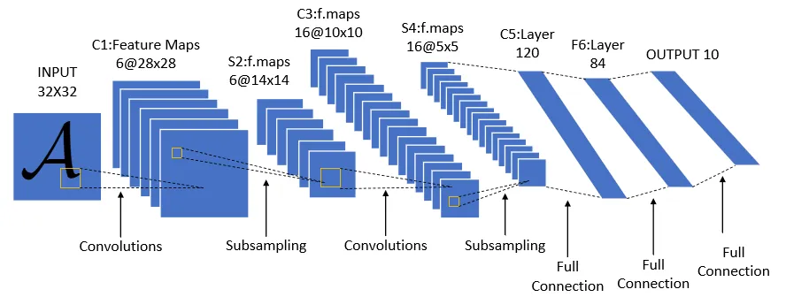
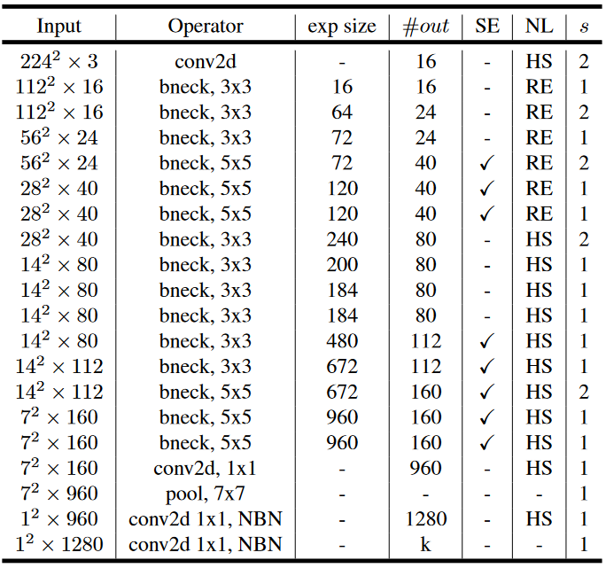
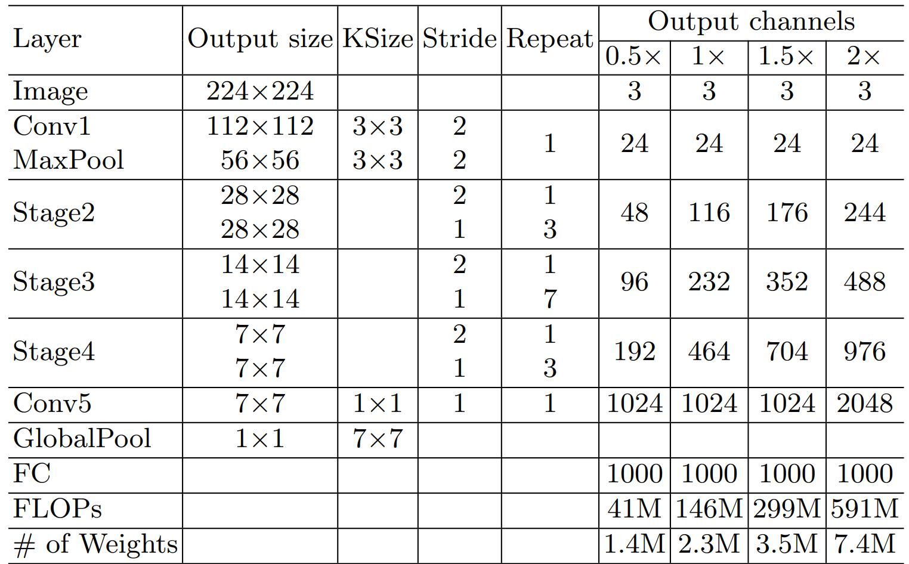

# Simple-CV-Pytorch-master

This code includes detection and classification tasks in Computer Vision, and semantic segmentation task will be added later.

For classification, I reproduced LeNet5, VGG16, AlexNet, ResNet(ResNeXt), GoogLeNet, MobileNet. Then I will reproduce ShuffleNet, EiffcientNet, etc.

For object detection, I reproduced RetinaNet and SSD. (I broke the code up into modules, such as backbones, necks, heads,loss,etc.This makes it easier to modify and add code.) Of course, other object detection algorithms will be added later.

Detailed explanation has been published on CSDN and Quora(Chinese) Zhihu.

[CSDN](https://blog.csdn.net/xiaoyyidiaodiao/category_11888930.html?spm=1001.2014.3001.5482)

[Quora(Chinese)Zhihu](https://www.zhihu.com/column/c_1523732135009198080)

You should create **checkpoint**(model save), **log**, **results** and **tenshorboard**(loss visualization) file
package.


Now, need to modify:

1.SSD(tools/detection/SSD/COCO) COCO (data/coco.py)

2.RetinaNet


## Compiling environment

Install requirements with pip (you can put requirements.txt to venv/Scripts/, if you need it.)

```
pip install -r requirements.txt
```

```
python == 3.8.5

torch == 1.11.0+cu113

torchaudio == 0.11.0+cu113

torchvision == 0.12.0+cu113

pycocotools == 2.0.4

numpy

Cython

matplotlib

opencv-python 

skimage (maybe you want to use it.)

tensorboard

tqdm

thop
```

## Dataset Path

Please, watch FolderOrganization.txt ( There are more details. )

## Folder Organization

```

I use Ubuntu20.04 (OS).

project path: /data/PycharmProject

Simple-CV-master path: /data/PycharmProject/Simple-CV-Pytorch-master
|
|----checkpoints ( resnet50-19c8e357.pth \COCO_ResNet50.pth[RetinaNet]\ VOC_ResNet50.pth[RetinaNet] )
|
|            |----cifar.py （ null, I just use torchvision.datasets.ImageFolder ）
|            |----CIAR_labels.txt
|            |----coco.py
|            |----coco_labels.txt
|----data----|----__init__.py
|            |----config.py ( path )
|            |----imagenet.py ( null, I just use torchvision.datasets.ImageFolder )
|            |----ImageNet_labels.txt
|            |----voc0712.py
|            |----voc_labels.txt
|                                     |----automobile.png
|----images----|----classification----|----crash_helmet.png
|              |                      |----photocopier.png
|              |                      |----sunflower.png
|              |
|              |----detection----|----000001.jpg
|              |                 |----000001.xml
|              |                 |----000002.jpg
|              |                 |----000002.xml
|              |                 |----000003.jpg
|              |                 |----000003.xml
|              | 
|              |----icon----|----alexnet.png
|              |            |----googlenet.png
|              |            |----lenet5.png
|              |            |----mobilenet_v2.png
|              |            |----mobilenet_v3_large.png
|              |            |----mobilenet_v3_small.png
|              |            |----resnet.png
|              |            |----resnext.png
|              |            |----retinanet.png
|              |            |----shufflenet_v2.png
|              |            |----ssd.png
|              |            |----vgg.png
|                     
|----log(XXX[ detection or classification ]_XXX[  train or test or eval ].info.log)
|
|----models----|----classification----|----__init__.py
|              |                      |----lenet5.py
|              |                      |----alexnet.py
|              |                      |----vgg.py
|              |                      |----resnet.py(include: resenext)
|              |                      |----googlenet.py
|              |                      |----mobilenet_v2.py
|              |                      |----mobilenet_v3.py 
|              |                      |----shufflenet.py
|              |                     
|              |----detection----|----__init__.py
|              |                 |----RetinaNet.py
|              |                 |----SSD.py   
|              |                 |----backbones----|----__init__.py ( Don't finish writing )
|              |                 |                 |----DarkNetBackbone.py
|              |                 |                 |----ResNetBackbone.py
|              |                 |                 |----VggNetBackbone.py
|              |                 |                 |----VovNetBackbone.py
|              |                 |                           
|              |                 |----necks----|----__init__.py
|              |                 |             |----FPN.py
|              |                 |             |----FPN.txt
|              |                 | 
|              |                 |----heads----|----__init.py
|              |                 |             |----RetinaNetHeads.py
|              |                 |             |----SSDHeads.py
|              |                 |
|              |                 |----anchor----|----__init__.py
|              |                 |              |----RetinaNetAnchors.py
|              |                 |              |----SSDAnchors.py
|              |                 |                    
|              |                 |----losses----|----__init.py
|              |                 |              |----RetinaNetLoss.py
|              |                 |              |----SSDLoss.py
|
|----results----|----SSD----|----VOC
|               |           |----COCO
|               |                          ( eg: detection ( VOC or COCO AP ) )
|               |----RetinaNet----|----VOC
|               |                 |----COCO
|
|----tensorboard ( Loss visualization )
|
|----tools                       |----eval.py
|         |----classification----|----train.py
|         |                      |----test.py
|         |
|         |                                   |----coco_eval.py
|         |                                   |----eval_coco.py
|         |                                   |----test.py        (need modify)
|         |----detection----|----RetinaNet----|----train.py
|                           |                 |----voc_eval.py
|                           |                 |----eval_voc.py
|                           |                                   
|                           |                                     |----eval_coco.py
|                           |                        |----COCO----|----coco_eval.py
|                           |                        |
|                           |                        |           |----eval_voc.py
|                           |----SSD----|----eval----|----VOC----|----voc_eval.py
|                           |           |----train.py
|                           |           |----visualize.py
| 
|                                   |----RetinaNetAugmentations.py      
|             |----augmentations----|----SSDAugmentations.py
|             |----accuracy.py
|             |----AverageMeter.py
|             |----BBoxTransform.py
|             |----ClipBoxes.py
|             |----collate.py
|             |----get_logger.py
|             |----iou.py            
|----utils----|----L2Norm.py
|             |----nms.py
|             |----path.py
|             |----Sampler.py 
|             |----scheduler.py
|
|----FolderOrganization.txt
|
|----main.py
|
|----README.md
|
|----requirements.txt

```

## Run the program

### 1.classification

- Reproduce network architectures

  1).EfficientNet

  (They should be placed in backbone of object detection, but they are used to extract features, just like classification networks)

  1).DarkNet

  2).VovNet

  (finished)
  

**1).LeNet5(models/classification/lenet5.py)**[1]




```
 I add nn.BatchNorm2d(). This is because that I was so upset about the poor accuracy.
 basenet: lenet5 (image size: 32 * 32 * 3)
 dataset: cifar
 batch_size: 32
 optim: SGD
 lr: 0.01
 momentum: 0.9
 weight_decay: 1e-4
 scheduler: MultiStepLR
 milestones: [15, 20, 30]
 gamma: 0.1
 poch: 30
 ```

Total:

| epochs |   times   |   avg top1 acc (%)  |  avg top5 acc (%)  |
|:------:|:---------:|:-------------------:|:------------------:|
|   30   | 0h11m44s  |         62.21       |        95.97       |

******************************

**2).AlexNet(models/classification/alexnet.py)**[2]


```
 I add nn.BatchNorm2d(). This is because that I was so upset about the poor accuracy.
 basenet: AlexNet (image size: 224 * 224 * 3)
 dataset: cifar
 batch_size: 32
 optim: SGD
 gamma: 0.1
 momentum: 0.9
 weight_decay: 1e-4
 scheduler: MultiStepLR
 milestones: [15, 20, 30]
 lr: 0.01
 epoch: 30
 ```

Total:

| epochs |  times   |   avg top1 acc (%)  |  avg top5 acc (%)  |
|:------:|:--------:|:-------------------:|:------------------:|
|   30   | 0h22m44s |        86.27        |        99.00       |

******************************

**3).VGG(models/classification/vgg.py)**[3]


```
 I add nn.BatchNorm2d() and transfer learning. This is because that I was so upset about the poor accuracy.
 basenet: vgg16 (image size: 224 * 224 * 3)
 dataset: cifar
 batch_size: 32
 optim: SGD
 lr: 0.01
 momentum: 0.9
 weight_decay: 1e-4
 scheduler: MultiStepLR
 milestones: [15, 20, 30]
 gamma: 0.1
 epoch: 30
 ```

Total:

| epochs |  times   |   avg top1 acc (%)  | avg top5 acc (%) |
|:------:|:--------:|:-------------------:|:----------------:|
|   30   | 1h23m43s |        76.56        |      96.44       |


******************************

**4).ResNet(models/classification/resnet.py)**[4]


```
 basenet: resnet18 
 dataset: ImageNet
 batch_size: 32
 optim: SGD
 lr: 0.001
 momentum: 0.9
 weight_decay: 1e-4
 scheduler: MultiStepLR
 milestones: [15, 20, 30]
 gamma: 0.1
 epoch: 30
```

| No.epoch | times/epoch | top1 acc (%) | top5 acc (%) |
|:--------:|:-----------:|:------------:|:------------:|
|     5    |  3h49min35s |    50.21     |    75.59     |

******************************

**5).ResNetXt(models/classification/resnet.py include: resnext50_32x4d,resnext101_32x8d)**[5]


```
 basenet: resnext50_32x4d
 dataset: ImageNet
 batch_size: 32
 optim: SGD
 lr: 0.001
 momentum: 0.9
 weight_decay: 1e-4
 scheduler: ReduceLROnPlateau
 patience: 2
 epoch: 30
 pretrained: True
```

| No.epoch | times/eopch | top1 acc (%) | top5 acc (%) |
|:--------:|:-----------:|:------------:|:------------:|
|     7    |  4h5min16s  |    72.28     |    91.56     |

******************************

**6).GoogLeNet(models/classification/googlenet.py)**[6]


```
 basenet: GoogLeNet 
 dataset: ImageNet
 batch_size: 32
 optim: SGD
 lr: 0.01
 momentum: 0.9
 weight_decay: 1e-4
 scheduler: ReduceLROnPlateau
 patience: 2
 epoch: 30
 pretrained: True
```

| No.epoch | times/eopch | top1 acc (%) | top5 acc (%) |
|:--------:|:-----------:|:------------:|:------------:|
|     5    |  3h54min31s |    42.70     |    69.34     |

******************************

**7).MobileNet(models/classification/mobilenet_v2.py or mobilenet_v3.py)**

***a).MobileNet_v2***[7]


```
 basenet: MobileNet_v2
 dataset: ImageNet
 batch_size: 32
 optim: SGD
 lr: 0.001
 momentum: 0.9
 weight_decay: 1e-4
 scheduler: ReduceLROnPlateau
 patience: 2
 epoch: 30
 pretrained: True
```

| No.epoch | times/epoch | top1 acc (%) | top5 acc (%) |
|:--------:|:-----------:|:------------:|:------------:|
|     5    |  3h58min3s  |    66.90     |    88.19     |

******************************

***b).MobileNet_v3***[8]

****(1).Large****



```
 basenet: MobileNet_v3_large
 dataset: ImageNet
 batch_size: 32
 optim: SGD
 lr: 0.001
 momentum: 0.9
 weight_decay: 1e-4
 scheduler: ReduceLROnPlateau
 patience: 2
 epoch: 30
 pretrained: True
```

| No.epoch | times/epoch | top1 acc (%) | top5 acc (%) |
|:--------:|:-----------:|:------------:|:------------:|
|     5    |  3h58min13s |    71.15     |    90.32     |

****(2).Small****


```
 basenet: MobileNet_v3_small
 dataset: ImageNet
 batch_size: 32
 optim: SGD
 lr: 0.001
 momentum: 0.9
 weight_decay: 1e-4
 scheduler: ReduceLROnPlateau
 patience: 2
 epoch: 30
 pretrained: True
```

| No.epoch | times/epoch | top1 acc (%) | top5 acc (%) |
|:--------:|:-----------:|:------------:|:------------:|
|     5    |  3h54min38s |    68.89     |    88.92     |

******************************

**8).ShuffleNet v2(models/classification/shufflenet.py)**[9]



```
 basenet: ShuffleNet_v2_x0_5
 dataset: ImageNet
 batch_size: 32
 optim: SGD
 lr: 0.001
 momentum: 0.9
 weight_decay: 1e-4
 scheduler: ReduceLROnPlateau
 patience: 2
 epoch: 30
 pretrained: True
```

| No.epoch | times/epoch | top1 acc (%) | top5 acc (%) |
|:--------:|:-----------:|:------------:|:------------:|
|     5    |  3h52min0s  |    55.61     |    78.84     |

******************************

- Run

```
#!/bin/bash
conda activate base
python /data/PycharmProject/Simple-CV-Pytorch-master/tools/classification/XXX.py(train.py or eval.py or test.py)
```

### 2.object detection

- Reproduce network architectures

  1).Faster RCNN

  2).YOLO

  (finished)
  
**1.SSD(models/detection/SSD.py)**[10]
 

 
```
 Network: ssd
 backbone: VggNet
 neck: SSDNeck
 loss: SSDLoss
 dataset: coco
 batch_size: 16
 optim: AdamW
 lr: 0.0001
 scheduler: ReduceLROnPlateau
 patience: 3
 epoch: 120
 pretrained: True
```

|  epochs  |    times   |  times/epoch | top1 acc (%) | top5 acc (%) |
|:--------:|:----------:|:------------:|:------------:|:------------:|
|    120   |  xxhxxmxxs |  xxhxxminxxs |    xxxxx     |    xxxxx     |


+ visualize


******************************

**2.RetinaNet(models/detection/RetinaNet.py)**[11]
 

 
```
 Network: RetinaNet
 backbone: ResNet
 neck: FPN
 loss: Focal Loss
 dataset: coco
 batch_size: 16
 optim: AdamW
 lr: 0.0001
 scheduler: ReduceLROnPlateau
 patience: 3
 epoch: 30
 pretrained: True
```

|  epochs  |    times   |  times/epoch | top1 acc (%) | top5 acc (%) |
|:--------:|:----------:|:------------:|:------------:|:------------:|
|    30    |  44h29m40s |  ~1h29min39s |    xxxxx     |    xxxxx     |


- Run

```
#!/bin/bash
conda activate base
python /data/PycharmProject/Simple-CV-Pytorch-master/tools/detection/XXX(eg:SSD or RetinaNet)/XXX.py(train.py or COCO/eval_coco.py or VOC/eval_voc.py or visualize.py)
```

### 3.semantic segmentation

- Reproduce network architectures

  1.FCN

  2.DeepLab

  3.U-Net
  

## references

[[1] LeCun Y, Bottou L, Bengio Y, et al. Gradient-based learning applied to document recognition[J]. Proceedings of the IEEE, 1998, 86(11): 2278-2324.](https://www.researchgate.net/publication/2985446_Gradient-Based_Learning_Applied_to_Document_Recognition)

[[2] Krizhevsky A, Sutskever I, Hinton G E. Imagenet classification with deep convolutional neural networks[J]. Advances in neural information processing systems, 2012, 25.](https://proceedings.neurips.cc/paper/2012/file/c399862d3b9d6b76c8436e924a68c45b-Paper.pdf)

[[3] Simonyan K, Zisserman A. Very deep convolutional networks for large-scale image recognition[J]. arXiv preprint arXiv:1409.1556, 2014.](https://arxiv.org/pdf/1409.1556.pdf%E3%80%82)

[[4] He K, Zhang X, Ren S, et al. Deep residual learning for image recognition[C]//Proceedings of the IEEE conference on computer vision and pattern recognition. 2016: 770-778.](https://arxiv.org/abs/1512.03385)

[[5] Xie S, Girshick R, Dollár P, et al.  Aggregated residual transformations for deep neural  networks[C]//Proceedings of the IEEE conference on computer vision and  pattern recognition. 2017: 1492-1500.](https://arxiv.org/pdf/1611.05431.pdf)

[[6] Szegedy C, Liu W, Jia Y, et al. Going deeper with convolutions[C]//Proceedings of the IEEE conference on computer vision and pattern recognition. 2015: 1-9.](https://sci-hub.wf/10.1109/cvpr.2015.7298594)

[[7] Sandler M, Howard A, Zhu M, et al.  Mobilenetv2: Inverted residuals and linear bottlenecks[C]//Proceedings  of the IEEE conference on computer vision and pattern recognition. 2018:  4510-4520.](https://openaccess.thecvf.com/content_cvpr_2018/papers/Sandler_MobileNetV2_Inverted_Residuals_CVPR_2018_paper.pdf)

[[8] Howard A, Sandler M, Chu G, et al.  Searching for mobilenetv3[C]//Proceedings of the IEEE/CVF international  conference on computer vision. 2019: 1314-1324.](https://openaccess.thecvf.com/content_ICCV_2019/papers/Howard_Searching_for_MobileNetV3_ICCV_2019_paper.pdf)

[[9] Ma N, Zhang X, Zheng H T, et al. Shufflenet v2: Practical guidelines for efficient cnn architecture design[C]//Proceedings of the European conference on computer vision (ECCV). 2018: 116-131.
](https://openaccess.thecvf.com/content_ECCV_2018/papers/Ningning_Light-weight_CNN_Architecture_ECCV_2018_paper.pdf)

[[10] Liu W, Anguelov D, Erhan D, et al. Ssd: Single shot multibox detector[C]//European conference on computer vision. Springer, Cham, 2016: 21-37.](https://link.springer.com/content/pdf/10.1007/978-3-319-46448-0_2.pdf)

[[11] Lin T Y, Goyal P, Girshick R, et al. Focal loss for dense object detection[C]//Proceedings of the IEEE international conference on computer vision. 2017: 2980-2988.](https://openaccess.thecvf.com/content_ICCV_2017/papers/Lin_Focal_Loss_for_ICCV_2017_paper.pdf)

